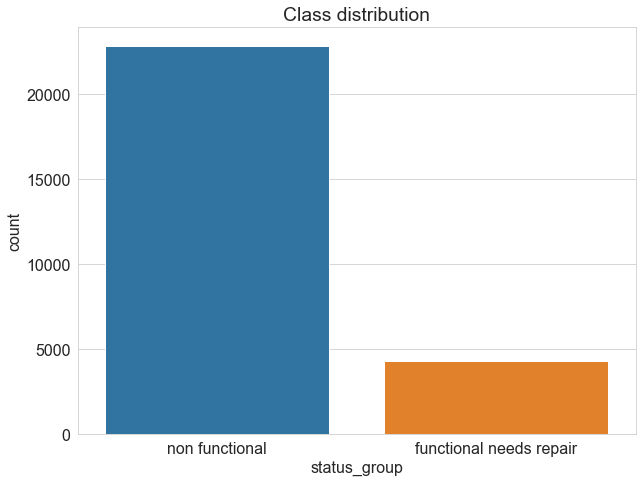
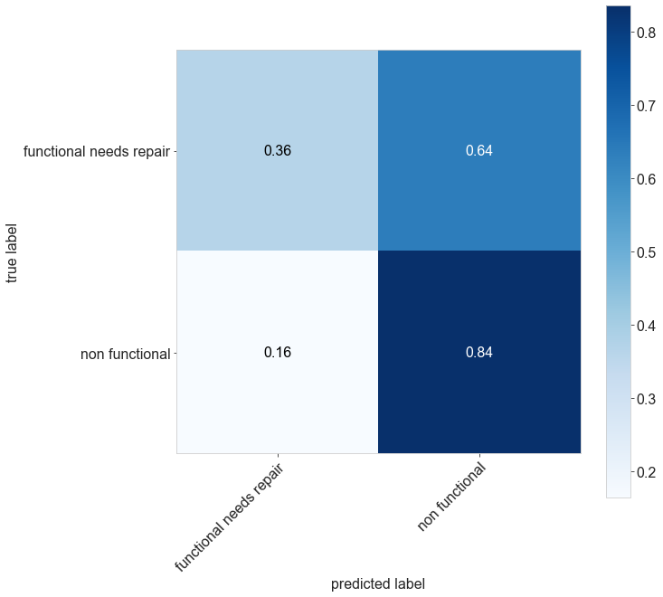

# Tanzania Water Points
Tanzania as a developing country, struggles with providing clean to its over 57 million population. There are already many water points set up across the country, but some are in need of repair while others have failed completely.

# Business Understanding
Tunza Jamii is a Non-Governmental-Organization in Tanzania which is interested in solving this problem. Due to the presence of many water points in Tanzania it's hard to identify ones in need of repair and those that are completely non functional. This is where this project comes to the rescue. 

In this project I trained various models till came up to a final effective model.

# Folders in this Project
**1.** **data** - contains data used in modellling this project.
**2.** **notebooks** - contains steps used to create this project. **NB:** Each notebook contains a numerical at its begining, indicating which step occured first and which one last.
**3.** **analysis-dfs** - contains exported sets from the notebooks, an exported set is used as data for another set.
**4**.**images** - images in this readme file are stored here.

# Tech Stack
* Python
* Pandas
* Matplotlib
* Seaborn
* Scikit-Learn
* imblearn
* mlxtend

# EDA
In this project, the main emphasis are two classes. i.e. non-functional classes water pumps and functional but need repair water pumps.

As seen above the class distribution is uneven. non-functional classes are dominating the data set. This is where the SMOTE function comes in hadny.

More on EDA is found in the EDA notebook in the folder notebooks.

# The target column
I this project the target column is converted into a binary format. Below is what 0 and 1 represent in this project.

0 - functional but need repair pumps
1 - non functional water pumps 

# The Best Model (conclusion)
After trainig various models and evaluating them, a best model was reached.

The best model is a random forest classifier with some few tuning. This model can be found as a class in the bestmodel notebook.

## Best Model  Results
### Confusion Matrix

### Scores in this model
The precision score is:	 0.8798436991208075
The recall score is:	 0.8357562635323229
The accuracy score is:	 0.7639653815892997
The f1 score is:	 0.857233502538071

**Interpretation**
* Precision-Score - If the model assigns 1 then there is a 88% chance that a water pump is actually non functional.
* Recall-Score - If a given water pump is actually 1 (non-functional) then there is a 83.6% that this model will label it as 1 (non-functional), and a 16.4% chance that it will incorrectly label it as 0 (functional but need repair).
* Accuracy-Score - The model accurately assigns 76.4% to the correct label.